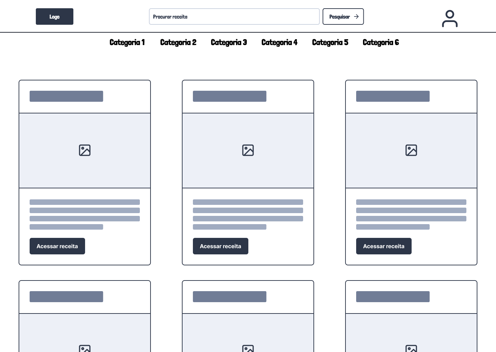

# Projeto de Interface[]

## User Flow

Nosso fluxo de usuário descreve o passo a passo sobre como o usuário, em verde, pode navegar entre as diversas telas.
Em laranja há o fluxo para que os usuários cadastrem e possam editar suas receitas.

## Wireframes

A página inicial, com suas ferramentas de navegação e listagem de receitas.

As seções de cadastro de usuário e de login

Tela para visualização da receita

Telas de perfil, com informações e formulários de alteração

Para que o usuário possa ver suas receitas publicadas

Para que o usuário possa visualizar as receitas que favoritou

Para que o usuário possa alterar as configurações do perfil de cadastro
