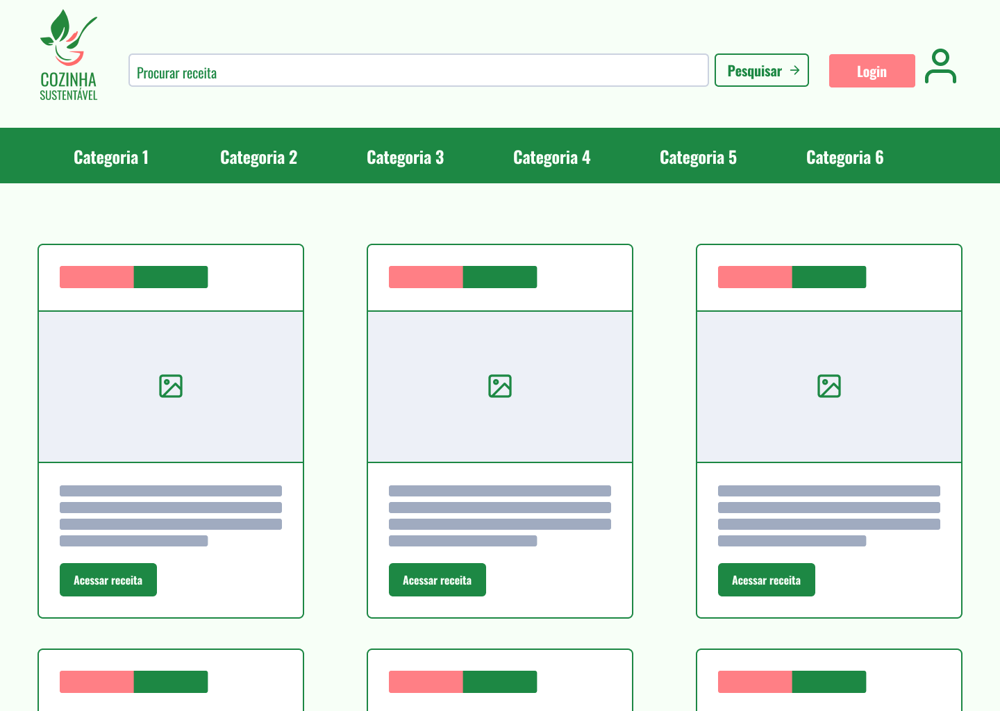
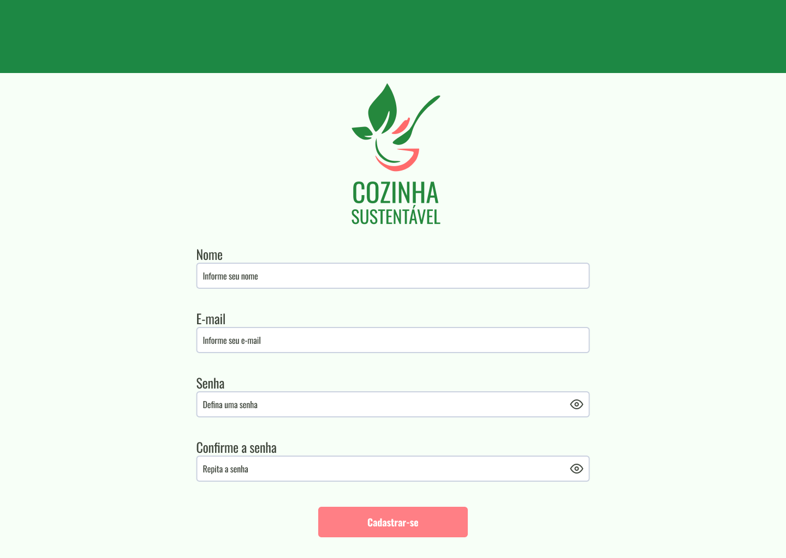
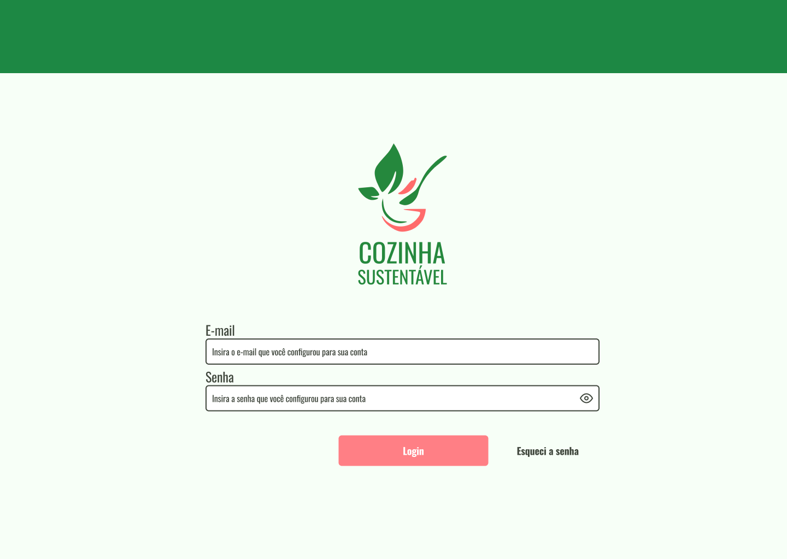
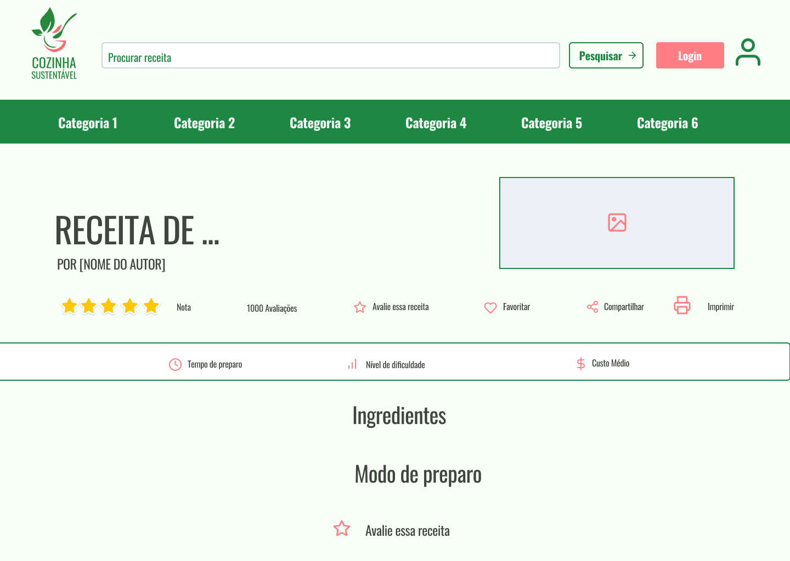
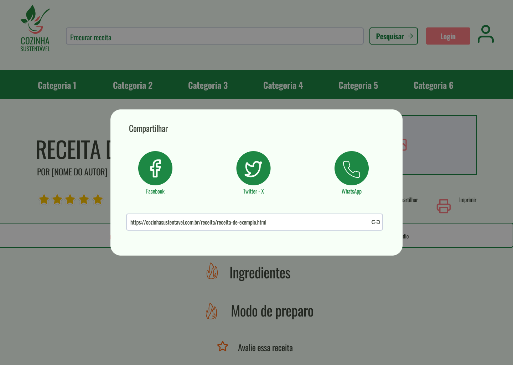
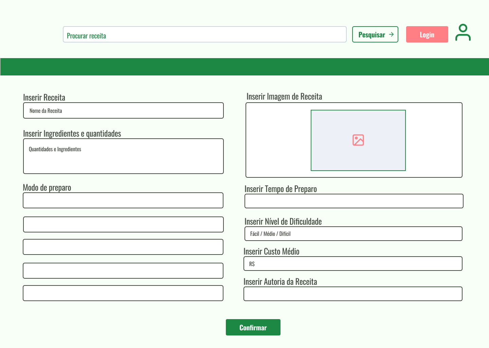
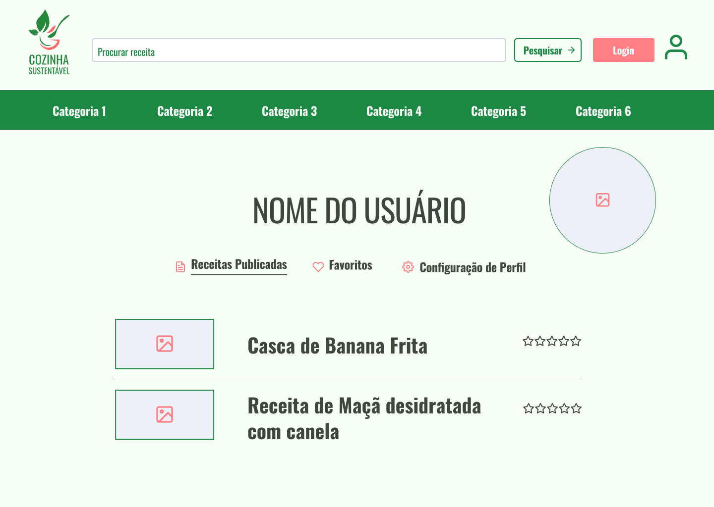
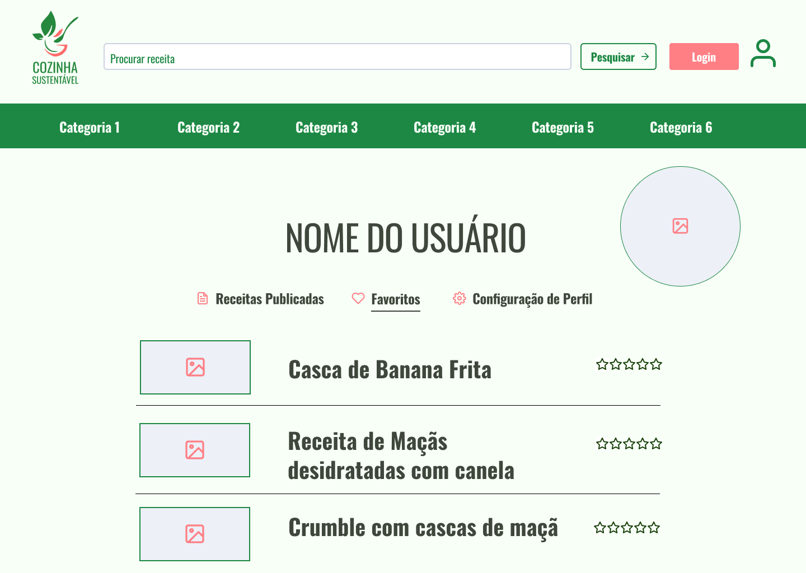
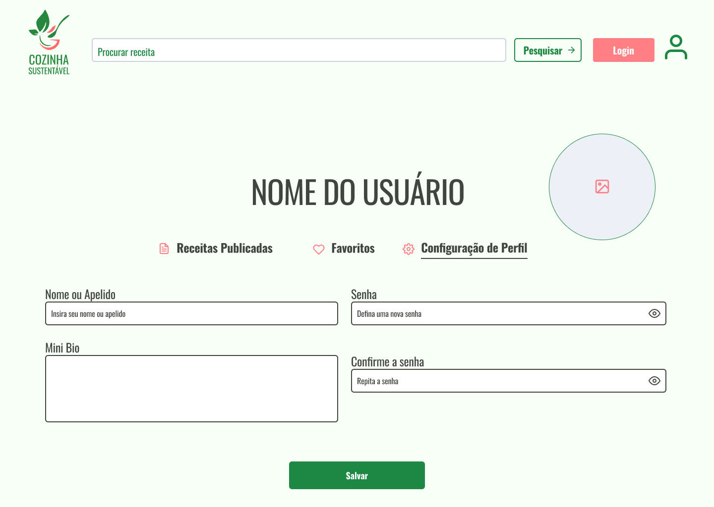

# Template padrão do site

## Design

## Cores

O esquema de cores é baseado em tons de verde, que remetem a sustentabilidade e detalhes em rosa que trazem maior suavidade para o design. Já o cinza é usado para balancear e neutralizar a paleta de cores.

## Tipografia

A fonte escolhida foi a Oswald pelo design clássico e minimalista que traz maior clareza para usuário ler e publicar receitas.

